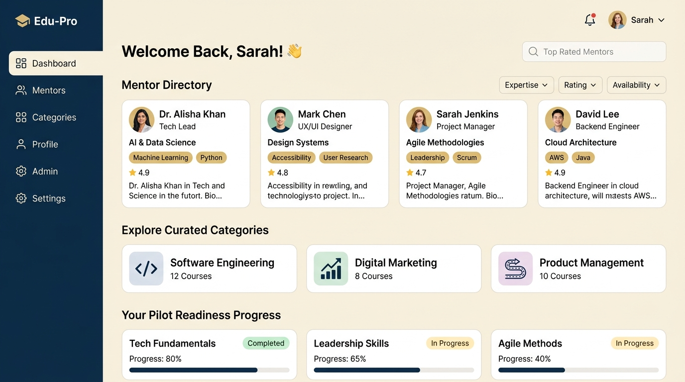
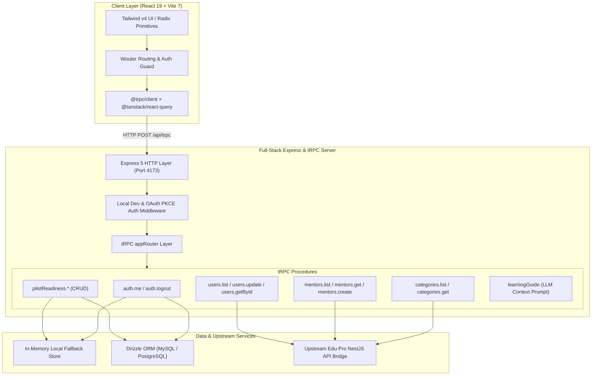

<div align="center">

# 🎓 Edu-Pro Portal
### *A Considered, Next-Generation Mentorship & Learning Platform*

[](https://www.typescriptlang.org/)
[](https://react.dev/)
[](https://vitejs.dev/)
[](https://expressjs.com/)
[](https://trpc.io/)
[](https://tailwindcss.com/)
[](https://orm.drizzle.team/)
[](https://pages.cloudflare.com/)

<p align="center">
  <b>Edu-Pro</b> transforms career curiosity into tangible momentum. Designed around an editorial dark navy and warm gold aesthetic, it bridges curious learners with vetted mentors, curated subject pathways, and an AI-driven learning guide.
</p>

[✨ Live Features](#-key-features) • [🏛 Architecture](#-system-architecture) • [🚀 Quick Start](#-quick-start) • [☁️ Cloudflare Deploy](#-cloudflare-deployment) • [📡 API Reference](#-api--trpc-contract-matrix)

---

</div>

## 📸 Visual Showcase

<div align="center">
  <h3>✨ Editorial Hero & Discovery Landing</h3>
  
  <br/><br/>
  <h3>⚡ Authenticated Learning Dashboard & Mentors Directory</h3>
  
</div>

---

## 🌟 Key Features

### 🎨 1. Editorial, High-Conversion UX
* **Asymmetric Hero & Typography**: Crafted with *Playfair Display* and *Inter*, evoking a calm, bespoke digital workspace.
* **Responsive Dark/Light Foundations**: Implemented with Tailwind CSS v4 and fluid CSS design tokens.
* **Micro-Interactions & Motion**: Smooth spring transitions powered by `@tailwindcss/vite` and `lucide-react`.

### 🧭 2. Mentorship & Discovery Directories
* **Mentors Directory**: Bounded pagination (`page`, `limit`), instant category/specialization filtering, loading skeletons, and resilient error fallback states.
* **Curated Categories**: Interactive pathway discovery drawer showing connected mentors, domain focus, and learning tracks.
* **Pilot Readiness Tracker**: Private checkpoint ledger to track career milestones and action items.

### 🛡️ 3. Full-Stack End-to-End Type Safety
* **tRPC v11 Procedure Matrix**: Zero API type-drift between the Express server and React client.
* **Zod v3 DTO Mirrors**: Strict input/output validation across users, mentors, categories, and AI procedures.
* **Hybrid Storage Architecture**: Seamless in-memory fallback for immediate zero-config local development, with first-class Drizzle ORM schema backing for PostgreSQL / MySQL in production.

### 🤖 4. Grounded AI Learning Guide
* Integrated contextual guidance turning broad learner intentions into concrete 35-word actionable next steps based solely on active directory inventory.

---

## 🏛 System Architecture



---

## 🛠️ Technology Stack

| Layer | Technologies |
| :--- | :--- |
| **Frontend** | React 19, TypeScript 5.7, Vite 7, Tailwind CSS v4, Wouter, Radix UI, Lucide Icons, Sonner |
| **Data Fetching** | tRPC v11, TanStack React Query v5, SuperJSON |
| **Backend** | Node.js (v20+), Express 4.21, Jose (JWT), Zod 3, Drizzle ORM |
| **Edge & Cloud** | Cloudflare Pages / Workers Ready (`wrangler.json`), Docker-compatible |
| **Quality & Tests** | Vitest, Contract Smoke Assertions, Strict TypeScript Checking |

---

## 🚀 Quick Start

### Prerequisites
* **Node.js**: `v20.0.0` or higher
* **pnpm**: `v9.0.0` or higher (`npm i -g pnpm`)

### 1. Clone & Install Dependencies
```bash
git clone https://github.com/ZiadtahaM/edu-pro.git
cd edu-pro
pnpm install
```

### 2. Configure Environment
```bash
cp .env.example .env
```
*(No configuration required for local dev — runs with built-in in-memory storage and instant local authentication!)*

### 3. Run Development Server
```bash
pnpm run build
$env:PORT="4173"; node dist/index.js
```
Open **[http://localhost:4173](http://localhost:4173)** in your browser!

---

## ☁️ Cloudflare Deployment

The application is pre-configured with [`wrangler.json`](./wrangler.json) for instant deployment to Cloudflare Pages:

### Deploy to Cloudflare Pages
```bash
# Build the production bundle
pnpm run build

# Deploy directly via Wrangler
pnpm exec wrangler pages deploy dist/public --project-name edu-pro-portal
```

Alternatively, connect your GitHub repository directly in the **Cloudflare Dashboard**:
* **Framework Preset**: `Vite`
* **Build Command**: `pnpm run build`
* **Build Output Directory**: `dist/public`

---

## 📡 API & tRPC Contract Matrix

All API endpoints are type-checked and accessible under `/api/trpc`:

| Procedure | Method | Access | Description |
| :--- | :--- | :--- | :--- |
| `auth.me` | `QUERY` | Public | Returns current authenticated session user. |
| `auth.logout` | `MUTATION` | Public | Clears session cookie and invalidates token. |
| `users.list` | `QUERY` | Admin | Paginated user management table query. |
| `users.assignSpecialization`| `MUTATION` | Protected | Multi-select category specialization sync. |
| `mentors.list` | `QUERY` | Public | Filtered mentor directory with page/limit constraints. |
| `categories.list` | `QUERY` | Public | Curated subject pathway catalog. |
| `pilotReadiness.list` | `QUERY` | Protected | Private learner milestone progress records. |
| `learningGuide` | `MUTATION` | Public | Grounded LLM learning path synthesis. |

> 📁 **Postman Collection**: A complete importable Postman collection is located at [`docs/edu-pro.postman_collection.json`](./docs/edu-pro.postman_collection.json).

---

## 🧪 Testing & Verification

Run the comprehensive test suite with Vitest:
```bash
pnpm run test
```

Typecheck the entire monorepo:
```bash
pnpm run check
```

---

## 📄 License

This project is licensed under the **MIT License**.
